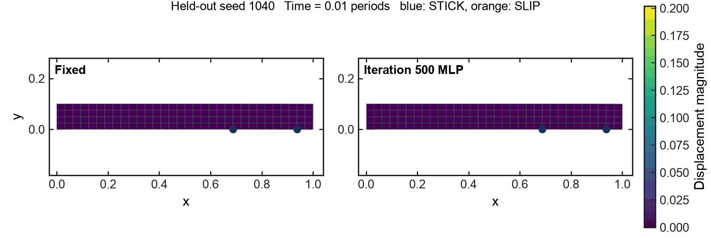
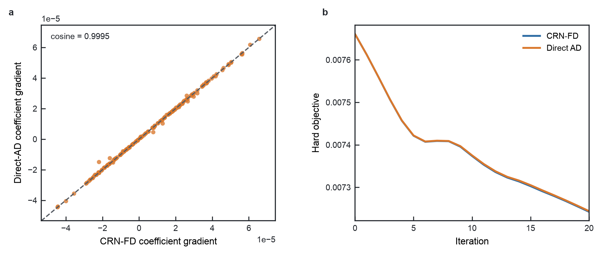
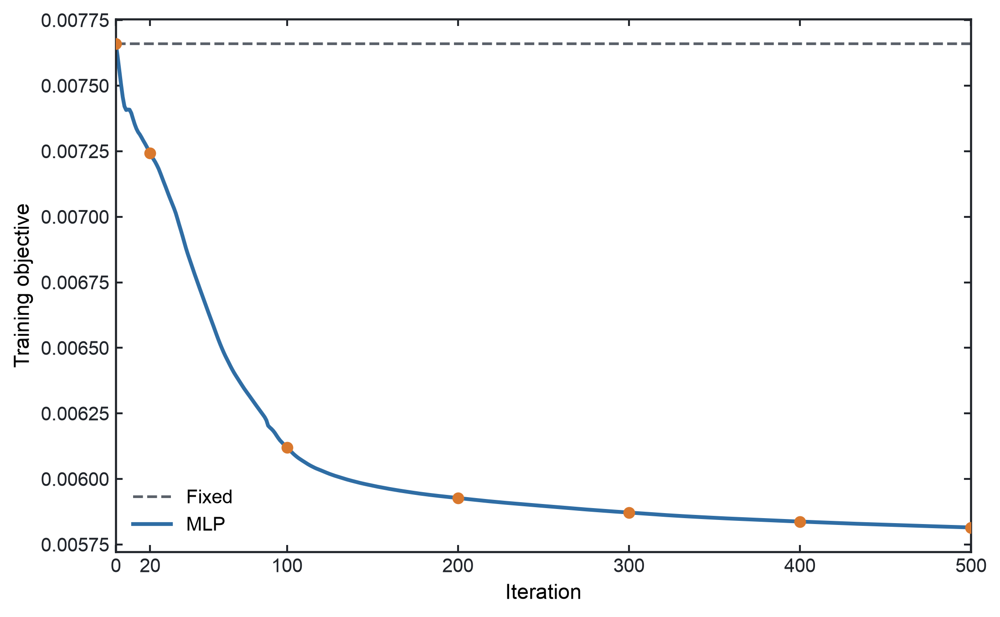
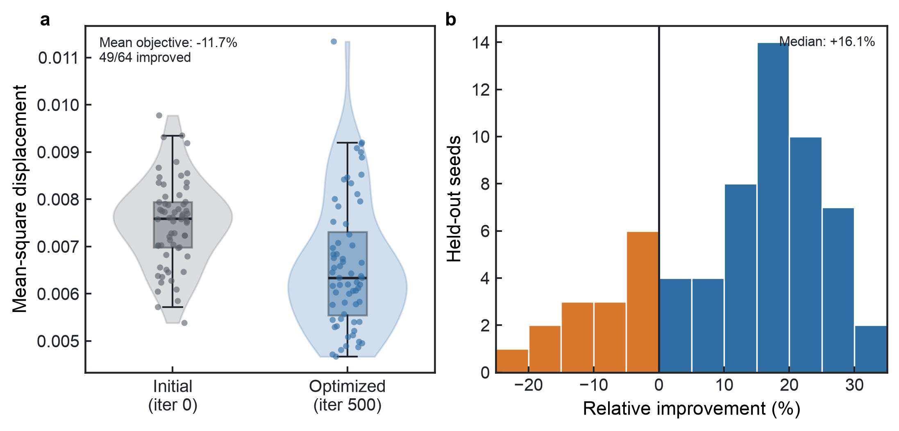

# End-to-End Stochastic Stick-Slip Optimization with Mixed Gradients

A compact benchmark that joins a PyTorch controller to hard stochastic JAX-FEM mechanics through two Tesseract components.

Built for the [Tesseract Hackathon 2026](https://pasteurlabs.ai/tesseract-hackathon-2026/), Hybrid ML + Mechanistic Models track.

| Free DOF | Neural parameters | Mechanics interface | Optimization | Train reduction | Held-out reduction | Held-out wins |
| ---: | ---: | ---: | ---: | ---: | ---: | ---: |
| 320 | 469 | 5D Fourier | 500 iterations | 24.09% | 11.71% | 49/64 |

## Problem

The model is a nondimensional two-dimensional cantilever with two hard Jenkins friction contacts. Random harmonic amplitudes and phases define one load history per seed. A semi-active controller changes the shared contact preload $N(t)$, which changes the friction threshold and the timing of STICK/SLIP events.

For forcing realization $\xi$, the loss is the time-averaged squared vertical displacement at one observation point:

$$
L(\theta;\xi)=\frac{1}{T}\sum_{t=1}^{T}x_{\mathrm{obs}}(t;\theta,\xi)^2,
\qquad
J(\theta)=\frac{1}{n}\sum_{i=1}^{n}L(\theta;\xi_i).
$$

The objective is an average over time and seeds. A controlled trajectory can therefore exceed the fixed-preload trajectory at individual instants while still reducing $J$.

## Why one gradient rule is not a good default

The 469 neural parameters live in a smooth PyTorch program and are a natural fit for autograd. The mechanics program is different: at each time step it enumerates nine coupled contact regimes, applies hard validity conditions, selects a regime with <code>argmax</code>, and updates two slider states. A coefficient perturbation can change a transition time, a state sequence, and the subsequent trajectory.

Naive JAX AD through this program differentiates the branch selected in the forward pass. It does not differentiate the discrete change in regime selection. The production mechanics VJP therefore uses common-random-number centered finite differences at the five-dimensional Fourier boundary. Positive and negative perturbations use the same forcing seeds, so the difference measures the response to the control perturbation rather than a change in random realization.

This is a component-level choice, not a claim that automatic differentiation cannot be used for stochastic systems.

## Direct AD versus CRN-FD

The final ablation holds the complete hard forward program fixed and changes only the mechanics backward rule. Both methods start from the same MLP parameters and use the same 32 training seeds, five Fourier coefficients, hard objective, Adam optimizer, and learning rate <code>0.01</code>.

| Quantity at the initial controller | CRN-FD | Direct AD | Comparison |
| --- | ---: | ---: | ---: |
| Coefficient-gradient norm | <code>3.121472e-4</code> | <code>3.105526e-4</code> | cosine <code>0.999455</code>, relative difference <code>3.3321%</code> |
| 469-parameter gradient norm | <code>1.495926e-3</code> | <code>1.490590e-3</code> | cosine <code>0.999970</code>, relative difference <code>0.8491%</code> |
| Hard objective, iteration 20 | <code>0.0072422650</code> | <code>0.0072439490</code> | reduction <code>5.4618%</code> vs <code>5.4398%</code> |

All <code>32/32</code> seeds changed at least one hard contact-state sequence under the nominal positive/negative coefficient perturbations. Despite that event sensitivity, naive branchwise AD closely matches CRN-FD at the initial controller and follows a nearly identical 20-step objective trajectory in this benchmark. CRN-FD finishes slightly lower, but the experiment does not support a claim that direct AD fails here. It shows why the mechanics boundary is kept explicit: its derivative rule can be tested and changed without altering the hard forward model or the PyTorch controller.

## Why Tesseract

Without a component boundary, the host would need to maintain a manual PyTorch/JAX bridge, implement the mechanics cotangent, and wire it back into the network. Tesseract gives each component ownership of the derivative rule appropriate to its implementation.

**Two Tesseracts. Two frameworks. Two derivative rules. One end-to-end gradient.**

| Component | Framework | Input → output | Production derivative |
| --- | --- | --- | --- |
| <code>fourier_controller</code> | PyTorch | <code>theta[469]</code>, <code>descriptors[8,6]</code> → <code>coeffs[8,5]</code> | autograd VJP |
| <code>stick_slip_fem</code> | JAX/JAX-FEM | <code>q[2]</code>, <code>coeffs[8,5]</code>, <code>seeds[8]</code> → <code>seed_losses[8]</code> | CRN centered-FD VJP |
| Host | PyTorch | <code>seed_losses</code> → scalar mean | <code>torch.mean</code> and <code>backward()</code> |

<pre>
theta [469]       forcing descriptors [8,6]
      \                    /
       v                  v
  +--------------------------------+
  | fourier_controller Tesseract   |
  | PyTorch MLP + autograd VJP     |
  +---------------+----------------+
                  | coeffs [8,5]
                  v
  +--------------------------------+
  | stick_slip_fem Tesseract       |
  | JAX-FEM + hard Jenkins         |
  | CRN centered-FD VJP            |
  +---------------+----------------+
                  | seed_losses [8]
                  v
             torch.mean
                  |
                  v
             loss.backward()
                  |
                  v
             dJ/dtheta [469]
</pre>

The controller emits five coefficients per seed,

$$
z=[a_0,a_1,b_1,a_2,b_2],
$$

which define the bounded preload

$$
N(t)=0.04+0.02\tanh\!\left[
a_0+a_1\cos(0.9\omega_1t)+b_1\sin(0.9\omega_1t)
+a_2\cos(1.35\omega_1t)+b_2\sin(1.35\omega_1t)
\right].
$$

Only this low-dimensional interface crosses the hard mechanics boundary. One centered mechanics VJP needs 10 batch forwards per eight-seed Tesseract call. Centered finite differences over all 469 neural weights would instead require 938 perturbed full-objective evaluations.

## Compact ablations

| Question | Controlled comparison | Result |
| --- | --- | --- |
| Does common randomness stabilize the finite difference? | Five fixed 5D gradient estimates, CRN vs independent negative-side seeds | Mean direction cosine <code>0.976504</code> vs <code>0.209988</code> |
| Why keep a 5D mechanics interface? | Five coefficient columns vs 469 neural weights | 10 batch forwards per mechanics VJP vs 938 weight perturbations |
| Does seed conditioning help? | Shared Fourier vs MLP Fourier on the H4 64-seed test | MLP objective <code>2.8648%</code> below Shared; 52/64 wins |
| Does branchwise AD disagree with CRN-FD here? | Same hard forward and 20-step optimizer settings | Initial theta cosine <code>0.999970</code>; reductions <code>5.4398%</code> vs <code>5.4618%</code> |

The earlier eight-seed experiment overfit: its MLP improved the training objective by <code>13.1509%</code> but increased the 32-seed test objective by <code>0.1833%</code>. Increasing the training set to 32 seeds recovered a <code>5.9386%</code> reduction on 64 new seeds. This is retained as a practical warning about stochastic training coverage, not as a general sample-complexity claim.

## Scientific result

The final scientific showcase uses a <code>32×4</code> QUAD4 mesh with 128 elements, 165 nodes, and 320 free DOF. Thirty-two training seeds are split into four fixed eight-seed Tesseract batches. Their losses are averaged before one backward pass and one Adam update. The reported controller is iteration 500, not a selected checkpoint.

| Metric | Initial | Iteration 500 | Change |
| --- | ---: | ---: | ---: |
| 32-seed train objective | <code>0.007660674831</code> | <code>0.005815166250</code> | <code>-24.0907%</code> |
| 64-seed held-out objective | <code>0.007484088873</code> | <code>0.006607333975</code> | <code>-11.7149%</code> |

The optimized controller improves 49 of 64 held-out realizations. The remaining 15 cases are included in the distribution; this is aggregate stochastic improvement, not a per-realization guarantee.

## Reproduce

Python 3.12 and [uv](https://docs.astral.sh/uv/) are required.

Quick tests and the H5 two-Tesseract regression:

    uv sync
    uv run pytest -q
    uv run python scripts/run_stage_h5.py

Full 500-iteration scientific showcase:

    uv run python scripts/run_showcase.py

The full showcase took about 37 minutes on the development Mac CPU.

Direct-AD ablation, after the full showcase has generated the matched CRN-FD history:

    uv run python scripts/run_direct_ad_ablation.py

The ablation reuses <code>outputs/showcase/training_history.npz</code> for the scientific iterations 0–20 reference.

## Limitations

This is a two-dimensional, nondimensional mechanics benchmark with synthetic harmonic forcing and Jenkins friction. It has no experimental validation, calibrated actuator model, sensing delay, saturation dynamics, or structure-specific performance claim. The direct-AD comparison covers one initialization and 20 optimizer steps; its close agreement with CRN-FD should not be generalized to all event-driven systems or parameter regimes.

## References

1. *Design of semi-active dry friction dampers for steady-state vibration: sensitivity analysis and experimental studies.* Journal of Sound and Vibration 459, 114850 (2019). [doi:10.1016/j.jsv.2019.114850](https://doi.org/10.1016/j.jsv.2019.114850)
2. *JAX-FEM: A differentiable GPU-accelerated 3D finite element solver for automatic inverse design and mechanistic data science.* Computer Physics Communications 291, 108802 (2023). [doi:10.1016/j.cpc.2023.108802](https://doi.org/10.1016/j.cpc.2023.108802)
3. *Tesseract Core: Universal, autodiff-native software components for Simulation Intelligence.* Journal of Open Source Software 10(111), 8385 (2025). [doi:10.21105/joss.08385](https://doi.org/10.21105/joss.08385)

## License

This repository is licensed under Apache-2.0. JAX-FEM is an external GPL-3.0 dependency; its source is not copied into this repository.
