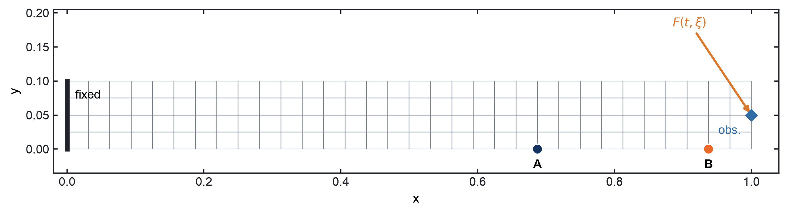
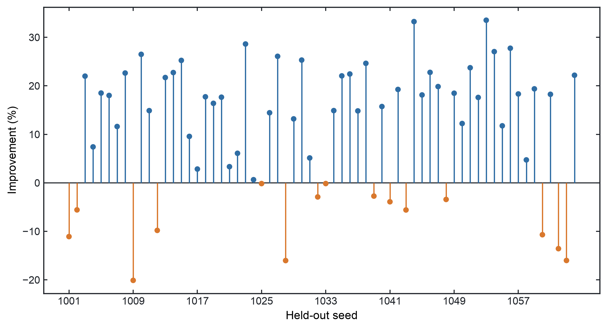
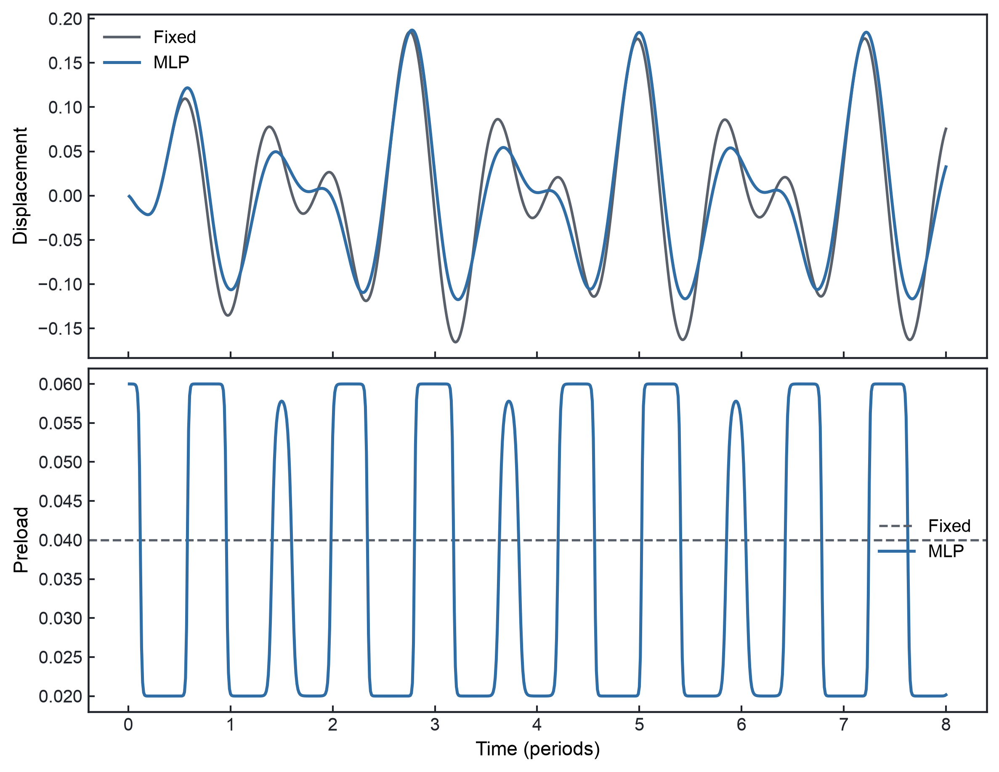

# End-to-End Stochastic Stick-Slip Vibration Control with Tesseract

A PyTorch controller learns a seed-conditioned friction preload through a JAX-FEM model with two hard stick-slip contacts.

Built for the [Tesseract Hackathon 2026](https://pasteurlabs.ai/tesseract-hackathon-2026/), track: **Hybrid ML + Mechanistic Models**.


| FEM model | Neural controller | Mechanics interface | Optimization | Held-out result |
| --- | --- | --- | --- | --- |
| 320 free DOF | 469 parameters | 5 Fourier coefficients | 500 Adam iterations, 24.09% train reduction | 11.71% reduction, 49/64 wins |

## The engineering problem

The benchmark is a stochastic two-dimensional cantilever with two hard Jenkins friction contacts. Random amplitudes and phases produce a different harmonic load history for each seed. A semi-active controller varies the shared contact preload \(N(t)\), which changes both the friction threshold and the timing of STICK/SLIP transitions.

For seed ξ, the loss is the time-averaged squared vertical displacement at the observation point:

$$
L(\theta;\xi)=\frac{1}{T}\sum_{t=1}^{T} x_{\mathrm{obs}}(t;\theta,\xi)^2,
\qquad
J(\theta)=\frac{1}{n}\sum_{i=1}^{n}L(\theta;\xi_i).
$$

The controller minimizes expected vibration energy over stochastic forcing histories. Because the objective averages squared displacement over time, the controlled trace can exceed the Fixed trace at individual instants. The model is a nondimensional mechanics benchmark; its results do not represent a validated building, aircraft, or experimental control system.

## Why this is a difficult gradient problem

The controller has 469 trainable PyTorch parameters. Those parameters are smooth and belong in autograd. The mechanics contains exact hard projections between STICK, SLIP+, and SLIP- regimes. A perturbation can change a transition time, the number of transitions, or the subsequent trajectory, so the mechanics boundary needs a gradient rule that preserves event switching.

A direct centered finite difference over the neural weights would require 938 perturbed evaluations per gradient. The Fourier representation compresses each seed's control to five coefficients. PyTorch differentiates the network, while common-random-number centered finite differences handle the nonsmooth mechanics interface.

## Why Tesseract?

Tesseract separates both a framework boundary and a derivative-strategy boundary:

| Component | Framework | Input → output | Derivative rule |
| --- | --- | --- | --- |
| `fourier_controller` | PyTorch | `theta[469]`, `descriptors[8,6]` → `coeffs[8,5]` | PyTorch autograd VJP |
| `stick_slip_fem` | JAX/JAX-FEM | `q[2]`, `coeffs[8,5]`, `seeds[8]` → `seed_losses[8]` | CRN centered-FD VJP |
| Host | PyTorch | `seed_losses[8]` → scalar mean | `torch.mean` and `loss.backward()` |

```text
theta [469]            forcing descriptors [8,6]
      \                         /
       +-----------------------+
                   |
                   v
       +--------------------------+
       | fourier_controller       |
       | PyTorch MLP 6->16->16->5 |
       | autograd VJP             |
       +-------------+------------+
                     | coeffs [8,5]
                     v
       +--------------------------+
       | stick_slip_fem           |
       | JAX-FEM + hard Jenkins   |
       | CRN centered-FD VJP      |
       +-------------+------------+
                     | seed losses [8]
                     v
              torch.mean(...)
                     |
                     v
               loss.backward()
                     |
                     v
              dJ/dtheta [469]
```

**Two Tesseracts. Two frameworks. Two derivative rules. One end-to-end gradient.**

Each Tesseract owns the derivative rule appropriate to its implementation. The host would otherwise have to maintain a manual PyTorch/JAX bridge and wire the mechanics finite-difference VJP back into the network.

## Method

### Neural Fourier control

The controller is a CPU/Float64 MLP with architecture `6 -> 16 -> 16 -> 5`. Its six inputs describe the two random forcing amplitudes and phases. For each seed it emits

$$
z=[a_0,a_1,b_1,a_2,b_2].
$$

The coefficients define the bounded preload

$$
\begin{aligned}
s(t) &= a_0+a_1\cos(\omega_a t)+b_1\sin(\omega_a t) \\
     &\quad+a_2\cos(\omega_b t)+b_2\sin(\omega_b t),\\
N(t) &= 0.04+0.02\tanh(s(t)),
\end{aligned}
$$

with \(\omega_a=0.9\omega_1\) and \(\omega_b=1.35\omega_1\). These five fixed modes provide a compact control surface. Training uses this basis directly, without an FFT or dynamic mode selection.

Each centered coefficient gradient uses one positive and one negative 8-seed batch forward per column. The mechanics VJP therefore costs 10 batch forwards, independent of the 469 neural parameters.

### Hard stick-slip mechanics

JAX-FEM assembles the structural stiffness, consistent mass, and distributed boundary load. The final mesh has 128 `QUAD4` elements, 165 nodes, 330 total DOF, and 320 free DOF after the left boundary is fixed.

Two Jenkins contacts act on lower-surface vertical DOFs at `x/L=0.6875` and `x/L=0.9375`. Each contact retains its own slider and regime state. At every time step, the solver enumerates the nine coupled regimes and selects the first state satisfying the exact stick-force and slip-direction conditions. The contact projection remains hard in the forward model.

### Common random numbers

For coefficient \(z_k\), the physics component estimates

$$
\frac{\partial J}{\partial z_k}
\approx
\frac{J(z+\varepsilon e_k;\,\xi)-J(z-\varepsilon e_k;\,\xi)}{2\varepsilon}.
$$

The positive and negative evaluations use the same forcing seeds. In five fixed H3 repeats, the mean cosine to the CRN mean gradient direction was `0.976504`. Using independent negative-side seeds reduced it to `0.209988`.

## Does each part matter?

### Shared waveform versus the MLP

H4 changed only the number of training seeds from 8 to 32. Fixed preload, one shared five-coefficient waveform, and the seed-conditioned MLP were then evaluated on 64 new seeds.

| Controller | 32-seed train objective | Improvement vs Fixed | 64-seed test objective | Improvement vs Fixed |
| --- | ---: | ---: | ---: | ---: |
| Fixed | `0.006504099115381487` | `0%` | `0.006348314853437941` | `0%` |
| Shared Fourier | `0.006288536550850767` | `3.3143%` | `0.006147424838351543` | `3.1645%` |
| MLP Fourier | `0.006108705858227541` | `6.0791%` | `0.005971312227273379` | `5.9386%` |

The MLP test objective was `2.8648%` lower than the Shared controller and won on 52 of 64 seeds in that comparison. The descriptor-conditioned network learns control beyond a single global waveform.

### A useful failure: eight training seeds

The earlier H3 MLP reduced its 8-seed training objective by `13.1509%`, then increased the 32-seed test objective by `0.1833%`. It won against the Fixed controller on only 16 of 32 unseen seeds. The same architecture trained on 32 seeds later reduced the 64-seed test objective by `5.9386%`.

This sequence isolates the source of the H3 failure: the seed-conditioned network had more fitting capacity than eight stochastic histories could support. Held-out evaluation occurred once, after training, and played no role in model selection or optimizer settings.

## Results

### 320-DOF FEM

The showcase scales the validated H5 pipeline from a 16x2 mesh to a 32x4 mesh. The physics, controller, optimizer, Fourier interface, hard contact law, and loss remain unchanged.



### Five hundred optimization iterations

Training uses 32 seeds split into four fixed 8-seed Tesseract batches. Their losses are averaged before one backward pass and one Adam update at `lr=0.01`. The reported controller is the fixed iteration-500 state.

| Iteration | Train objective |
| ---: | ---: |
| 0 | `0.007660674831379117` |
| 100 | `0.006120562168107167` |
| 500 | `0.005815166249899522` |

Iteration 500 is also the minimum training objective. The full run reduced the objective by `24.0907%` and took `2230.45 s` on a Mac CPU.


The animation replays every saved controller state from iteration 0 through 500. The axes stay fixed so the waveform and response remain directly comparable.


### Held-out stochastic response

The iteration-500 controller was evaluated once on 64 seeds that were absent from training.

| Metric | Fixed | Iteration-500 MLP |
| --- | ---: | ---: |
| Mean objective | `0.007484088872760848` | `0.006607333975056811` |
| Mean reduction | `0%` | `11.7149%` |
| Per-seed wins | | `49 / 64` |

The figure retains all 64 seeds; 15 have negative improvement.



### Representative response

The fixed median rule selected seed `1040`: its `15.7343%` improvement is closest to the 64-seed median of `16.0646%`. Some controlled displacement peaks exceed the Fixed trace, while the time-averaged squared response is lower.

At contacts A and B, the Fixed controller has `11/11` and `15/15` STICK-to-SLIP/SLIP-to-STICK events. The trained controller has `15/15` events at both contacts. The controller changes the event sequence without eliminating hard switching.



## Reproduce

Python 3.12 and [uv](https://docs.astral.sh/uv/) are required.

### Quick two-Tesseract verification

This run checks the controller forward/VJP, the physics boundary, end-to-end `loss.backward()`, and the 20-step H5 regression.

```bash
uv sync
uv run pytest -q
uv run python scripts/run_stage_h5.py
```

### Full showcase

```bash
uv run python scripts/run_showcase.py
```

The 500-step Mac CPU run takes about 37 minutes on the development machine. It rebuilds the optimization history and media under `outputs/showcase/`. Git tracks the two GIFs and four PNGs. The runner also regenerates the larger trajectory and checkpoint arrays locally.

## Repository structure

```text
stochastic_stick_slip/
  model.py                    JAX-FEM assembly, forcing, and hard contacts
  controller.py               deterministic PyTorch MLP
  showcase.py                 32x4 model binding
tesseracts/
  fourier_controller/         PyTorch apply and autograd VJP
  stick_slip_fem/             physics apply and CRN-FD JVP/VJP
  stochastic_objective/       legacy H1-H4 compatibility component
scripts/
  run_stage_h5.py             quick two-Tesseract regression
  run_showcase.py             500-step run and visualization
tests/                        focused physics and composition tests
outputs/showcase/             final GIF and PNG media
```

## Development and ablations

`H1` established a minimal stochastic hard-contact descent step. `H1.5` added the second coupled contact. `H2` connected the Fourier MLP to PyTorch backward. `H3` exposed 8-seed overfitting and measured the CRN advantage. `H4` restored held-out performance with 32 training seeds. `H5` moved the PyTorch controller behind its own Tesseract and reproduced the prior objectives exactly.

The older stage runners and figures remain in the repository so each claim can be reproduced independently.

## Scope and limitations

This is a two-dimensional, nondimensional mechanics benchmark driven by synthetic stochastic harmonic forcing. It uses a Jenkins friction model and a bounded preload command without actuator dynamics. Experimental validation and structure-specific performance assessment remain outside the current scope.

A physical demonstrator would require calibrated material, contact, forcing, sensor, and actuator models before the controller could be assessed experimentally.

## References

1. *Design of semi-active dry friction dampers for steady-state vibration: sensitivity analysis and experimental studies.* Journal of Sound and Vibration 459, 114850 (2019). [doi:10.1016/j.jsv.2019.114850](https://doi.org/10.1016/j.jsv.2019.114850)
2. *JAX-FEM: A differentiable GPU-accelerated 3D finite element solver for automatic inverse design and mechanistic data science.* Computer Physics Communications 291, 108802 (2023). [doi:10.1016/j.cpc.2023.108802](https://doi.org/10.1016/j.cpc.2023.108802)
3. *Tesseract Core: Universal, autodiff-native software components for Simulation Intelligence.* Journal of Open Source Software 10(111), 8385 (2025). [doi:10.21105/joss.08385](https://doi.org/10.21105/joss.08385)

## License

This repository is licensed under Apache-2.0. JAX-FEM is an external GPL-3.0 dependency; its source is not copied into this repository.
