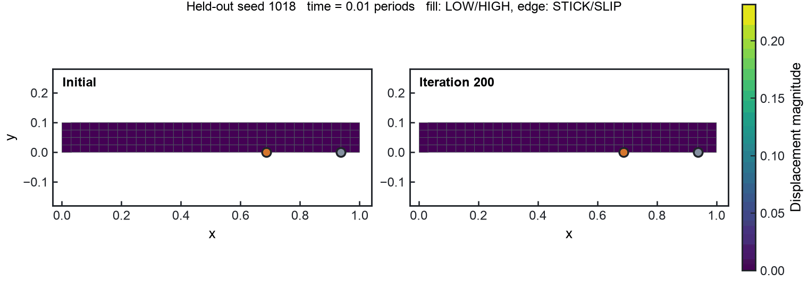
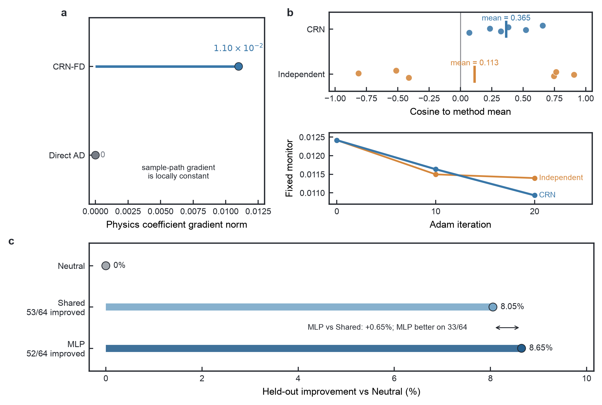
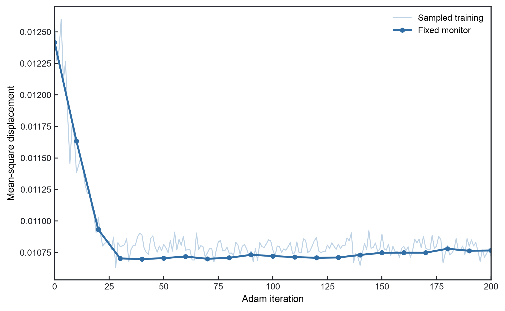
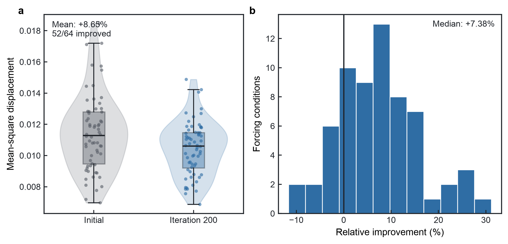

# End-to-End Optimization through Stochastic Markov-Jump Mechanics

*Mixed PyTorch-autograd and CRN finite-difference gradients composed with Tesseract*

A PyTorch controller learns stochastic switching policies for semi-active friction dampers through a hard Markov-jump JAX-FEM simulator whose sample-path coefficient gradient under direct AD is exactly zero.

| Neural parameters | Physics interface | Direct AD | Fixed monitor | Held-out | Improved cases |
| ---: | ---: | ---: | ---: | ---: | ---: |
| 469 | 5D | 0 | 13.29% reduction | 8.65% reduction | 52/64 |

Built for the [Tesseract Hackathon 2026](https://pasteurlabs.ai/tesseract-hackathon-2026/), Hybrid ML + Mechanistic Models track.

## 1. The engineering problem

The benchmark models a nondimensional two-dimensional cantilever under uncertain periodic loading. Two semi-active dry-friction contacts act on the lower edge. Each device has two permitted preload states: `LOW = 0.02` and `HIGH = 0.06`. The controller does not prescribe a continuous friction force. It changes the rates of the random `LOW -> HIGH` and `HIGH -> LOW` transitions. The sampled preload then enters a hard Jenkins contact law, which determines STICK or SLIP at every physical time step.

The finite-element model uses a `32 x 4` QUAD4 mesh, 165 nodes, and 320 free degrees of freedom. Its left edge is clamped. A distributed load acts on the right edge, the protected displacement is measured there, and the two friction contacts sit near the free end. The forcing combines harmonics at `1.00` and `1.35` times the first natural frequency. Random amplitudes and phases define one reproducible forcing condition.

For forcing condition $\xi$ and Markov realization $\omega$, the trajectory loss is the time-mean squared displacement at the observation point:

$$
L(\theta;\xi,\omega)
=\frac{1}{800}\sum_{n=1}^{800}
x_{\mathrm{obs},n}(\theta;\xi,\omega)^2.
$$

Training minimizes the mean over forcing conditions and four Markov realizations per condition. This is a literature-grounded numerical benchmark. It is not an experimentally validated damper or a calibrated structural model.

## 2. Why Direct AD is zero here

The controller emits five Fourier coefficients. They define a bounded policy signal $s(t)$ and two transition probabilities:

$$
p_{\mathrm{LH}}(t)=1-\exp[-\lambda_0\exp(\beta\tanh s(t))\Delta t],
$$

$$
p_{\mathrm{HL}}(t)=1-\exp[-\lambda_0\exp(-\beta\tanh s(t))\Delta t].
$$

Uniform random numbers turn those probabilities into hard Boolean mode decisions. The mechanics core receives only the resulting two-contact preload history and fixed damping. It has no coefficient, probability, rate, Fourier basis, or random-tape input.

That interface determines the sample-path derivative. Hold the random tape fixed and perturb a coefficient by a small amount. If every threshold comparison returns the same mode sequence, the mechanics core still receives exactly the same sequence of `0.02` and `0.06` values. Its trajectory and loss are unchanged. The sampled loss is locally constant with respect to the coefficient even though its expectation changes when a perturbation is large enough to alter a mode decision.

Gate A measured the raw coefficient gradient through the complete hard forward program:

```text
Direct AD  = [0, 0, 0, 0, 0]

CRN-FD     = [-0.00858, +0.00059, +0.00399, -0.00040, +0.00555]
FD L2 norm = 0.01099
```

The zero is a consequence of the hard random program. The implementation adds no `stop_gradient` operation. Direct AD remains appropriate inside smooth parts of the computation; it simply cannot detect a neighboring discrete sample-path change at this boundary.

Centered finite differences can cross those decision thresholds. For coefficient $z_j$,

$$
\widehat g_j=
\frac{J(z+\varepsilon e_j;\xi,\omega)-J(z-\varepsilon e_j;\xi,\omega)}
{2\varepsilon}, \qquad \varepsilon=0.02.
$$

Both sides use the same forcing and the same uniform tape. This common-random-number (CRN) coupling isolates the coefficient perturbation from an unrelated change in Monte Carlo noise.

## 3. Mixed-gradient architecture

The differentiable program has two components and two derivative rules. Together they expose one ordinary backward pass to the optimizer.

<pre>
forcing descriptor
      |
      v
PyTorch controller, theta [469] -- autograd VJP
      |
      v
five Fourier rate coefficients
      |
      v
Tesseract boundary
      |
      v
hard Markov LOW/HIGH switching
      |
      v
hard Jenkins STICK/SLIP + JAX-FEM -- same-tape CRN-FD VJP
      |
      v
seed losses -- mean -- loss.backward() -- dJ/dtheta
</pre>

`fourier_controller` is a PyTorch `6-16-16-5` MLP. Six forcing descriptors encode the two amplitudes and phases. Its 469 parameters map each condition to five rate coefficients, and PyTorch autograd supplies the controller VJP.

`markov_jump_fem` owns the hard Markov generator, the two coupled Jenkins contacts, and the [JAX-FEM](https://github.com/deepmodeling/jax-fem) structural response. The component receives `coeffs[8,5]`, eight forcing seeds, and explicit `uniforms[8,4,801,2]`. It returns eight realization-averaged losses plus small Markov diagnostics. Its coefficient VJP uses five coordinate-wise centered differences, so one backward call requires ten stochastic batch forwards. The VJP multiplies the resulting `[8,5]` Jacobian by the incoming cotangent without another seed average.

Long training uses 32 forcing conditions in four eight-condition component calls. Their 32 losses are concatenated before one `.mean().backward()` and one Adam update. Thus each forcing condition has the intended upstream weight of `1/32`.

Two components, two derivative rules, one end-to-end optimizer.

## 4. Why Tesseract?

The software boundary matches the mathematical boundary. PyTorch owns the parameter graph and its smooth VJP. The stochastic JAX program owns the hard forward model and its five-dimensional CRN-FD VJP. [Tesseract](https://github.com/pasteurlabs/tesseract-core) routes values and cotangents between them, so the host sees a composed differentiable function.

A manual bridge would have to preserve PyTorch's parameter graph while calling JAX, implement the physics cotangent, and route it back with the right shape and dtype. Tesseract assigns those responsibilities to the components while leaving the host training loop conventional. Containerization is incidental here. The reason for the boundary is the combination of different frameworks and different justified derivative rules.

## 5. Does each design choice matter?



| Question | Controlled evidence |
| --- | --- |
| Why replace Direct AD at the physics boundary? | The hard sample-path coefficient gradient is exactly zero, while CRN-FD has L2 norm `0.01099`. |
| Why share random tapes? | CRN cosine-to-method-mean is `0.365`, versus `0.113` with independent tapes; its 20-step monitor also finishes lower. |
| How much does the controller structure matter? | Shared Fourier improves held-out loss by `8.05%`; forcing-conditioned MLP improves it by `8.65%`. |
| Does the FD-trained policy transfer? | The final MLP improves 52 of 64 held-out forcing conditions. |

CRN improves gradient repeatability relative to independent tapes, but six finite-bank estimates still vary. Its mean cosine remains moderate at `0.365`. Over the matched 20-step comparison, the CRN fixed monitor falls from `0.0124165` to `0.0109324`; the independent-tape branch reaches `0.0113970`.

The controller ablation gives a second qualification. A shared time-varying switching policy already captures most of the benefit, reducing held-out loss by `8.05%` and winning on 53 of 64 conditions. Forcing conditioning provides a modest additional aggregate gain: the MLP is `0.6469%` below Shared and wins their paired comparison on 33 of 64 conditions. The Shared result supplies most of the control benefit; the MLP adds condition-specific refinement.

## 6. Optimization results

The final run performs exactly 200 Adam updates at learning rate `0.01`. Every update uses a newly sampled Markov tape bank, while all ten positive and negative VJP evaluations within that update share the bank. A separate fixed bank is evaluated every ten iterations. Because the sampled training bank changes between iterations, the fixed monitor is the comparable optimization trace.



The fixed monitor decreases from `0.0124165` to `0.0107664`, a `13.29%` reduction. After training, one independent held-out bank evaluates 64 new forcing conditions with four realizations each. The initial and optimized controllers use the same held-out tapes, and the four realization losses are averaged before forming forcing-level statistics.



Held-out mean loss decreases from `0.0114268` to `0.0104386`, or `8.65%`. The median forcing-level improvement is `7.38%`, and 52 of 64 conditions improve. The histogram retains the adverse cases; the result is an aggregate reduction rather than a guarantee for every forcing condition.

### Learned switching behavior

The optimized policy spends more time in HIGH preload and switches less often in this benchmark:

| Contact | HIGH occupancy, initial | HIGH occupancy, optimized | Mean transitions, initial | Mean transitions, optimized |
| --- | ---: | ---: | ---: | ---: |
| A | 0.492 | 0.796 | 8.08 | 6.49 |
| B | 0.514 | 0.797 | 8.03 | 6.32 |

Under this operating condition, the learned rates favor longer HIGH-preload residence periods. This observation is specific to the numerical system studied here.

## 7. How it works

Randomness is explicit and reproducible. A bank is indexed by stream, training iteration, forcing seed, and realization. The two contacts share one policy but receive independent uniform tapes. For each of the 800 physical steps, the Markov generator first updates both modes and then maps them to fixed preloads. The Jenkins solver evaluates the nine possible two-contact STICK/SLIP regimes and advances the finite-element state.

The main implementation is intentionally small:

```text
stochastic_stick_slip/
    model.py                 mechanics core and Jenkins regimes
    markov_jump.py           rates, probabilities, and hard mode sampling
    engineering_markov.py    frozen benchmark and explicit tape banks

tesseracts/
    fourier_controller/      PyTorch forward and autograd VJP
    markov_jump_fem/         hard JAX forward and CRN-FD VJP

scripts/
    run_markov_jump_gate_a.py
    run_markov_jump_gate_c.py
    run_markov_jump_long_training.py
    run_markov_jump_ablation.py
```

Gate A checks the structural derivative claim: Direct AD is zero, CRN-FD is finite and nonzero, and coefficient perturbations change sampled mode histories. Gate C then composes both Tesseracts and confirms that the mixed gradient can move all 469 controller parameters and reduce an independent hard objective.

## 8. Reproduce

Python 3.12 and [uv](https://docs.astral.sh/uv/) are required.

Quick environment and test check:

```bash
uv sync
uv run pytest -q
```

Run the two short gates that establish the gradient and composition claims:

```bash
uv run python scripts/run_markov_jump_gate_a.py
uv run python scripts/run_markov_jump_gate_c.py
```

Run the complete 200-step stochastic optimization and regenerate its media:

```bash
uv run python scripts/run_markov_jump_long_training.py
```

The full run takes about 40 to 45 minutes on the development Mac CPU. It uses the frozen seed sets, streams, `R=4`, finite-difference step, Adam settings, and 200-update schedule encoded in the runner.

## 9. Scope and limitations

This repository is a nondimensional two-dimensional benchmark with synthetic two-frequency forcing, an idealized two-state preload actuator, and finite Monte Carlo banks. It has no experimental validation, actuator delay, sensing model, or parameter calibration for a specific structure. CRN reduces random cancellation in the finite difference but leaves visible finite-bank variance. The forcing-conditioned MLP also adds only a modest improvement over the five-parameter Shared policy in the present setup.

The first continuous-preload prototype exposed a branchwise AD shortcut, which motivated the hard Markov-jump redesign. The legacy code remains in the repository for provenance, while this README reports only the Markov-jump benchmark. Larger banks, stronger stochastic couplings, and experimentally calibrated friction devices are natural follow-up studies.

## 10. References

1. Y. G. Wu et al., "Design of semi-active dry friction dampers for steady-state vibration: sensitivity analysis and experimental studies," *Journal of Sound and Vibration* 459, 114850 (2019). [doi:10.1016/j.jsv.2019.114850](https://doi.org/10.1016/j.jsv.2019.114850)
2. F. Blanchini, D. Casagrande, P. Gardonio, and S. Miani, "Constant and switching gains in semi-active damping of vibrating structures," *International Journal of Control* 85(12), 1886-1897 (2012). [doi:10.1080/00207179.2012.710915](https://doi.org/10.1080/00207179.2012.710915)
3. H. Hu, A. Batou, and H. Ouyang, "Friction-induced vibration of a stick-slip oscillator with random field friction modelling," *Mechanical Systems and Signal Processing* 183, 109572 (2023). [doi:10.1016/j.ymssp.2022.109572](https://doi.org/10.1016/j.ymssp.2022.109572)
4. D. F. Anderson, "An efficient finite difference method for parameter sensitivities of continuous time Markov chains," *SIAM Journal on Numerical Analysis* 50(5), 2237-2258 (2012). [doi:10.1137/110849079](https://doi.org/10.1137/110849079)

The benchmark uses ordinary same-tape CRN centered differences. It does not implement Anderson's split coupling.

## License

This repository is licensed under Apache-2.0. JAX-FEM is an external GPL-3.0 dependency; its source is not copied into this repository.
