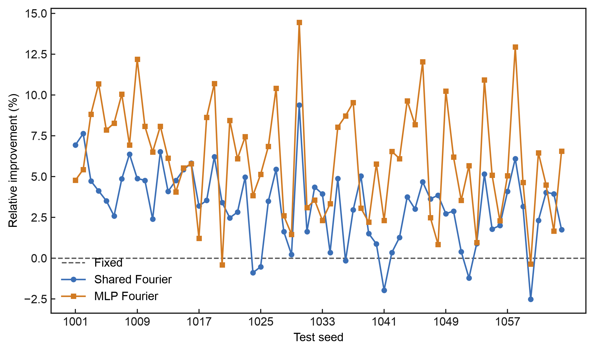
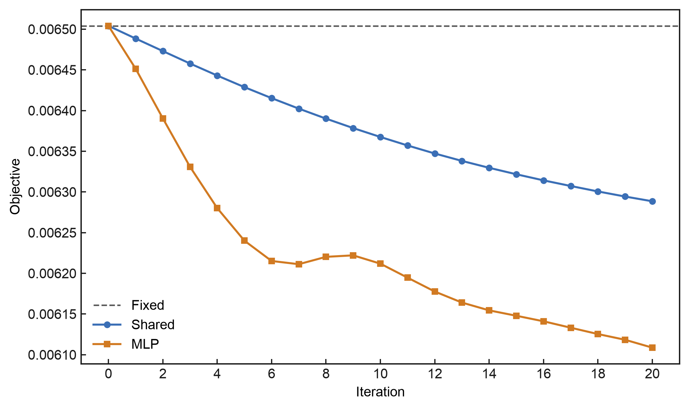
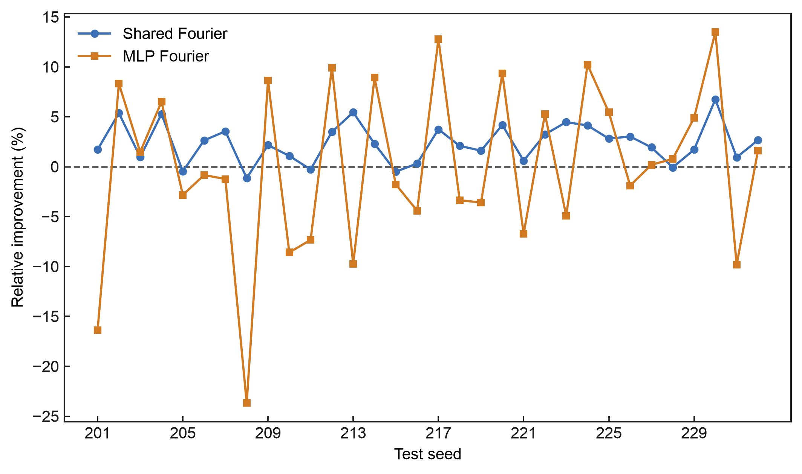
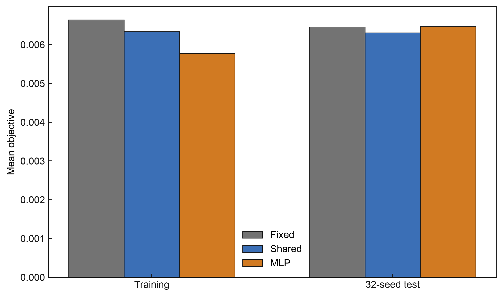
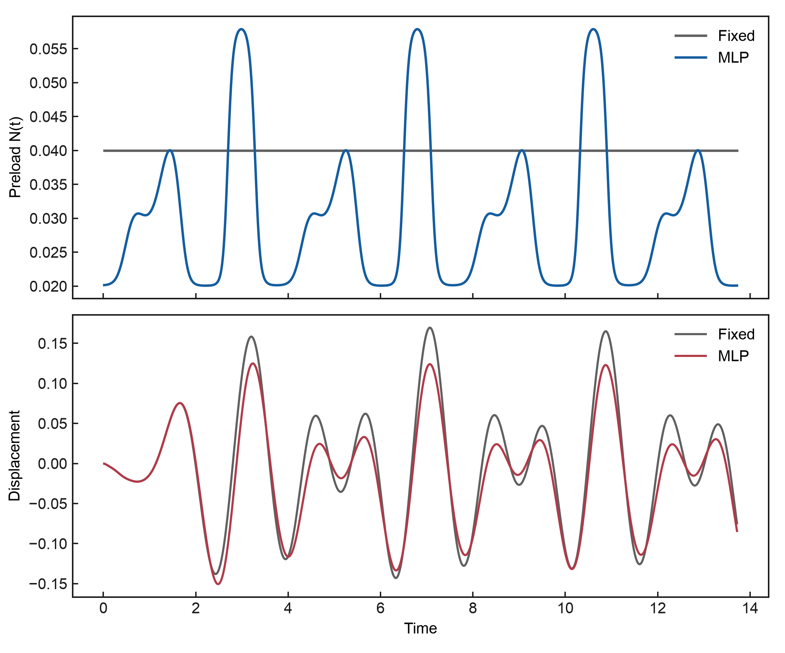
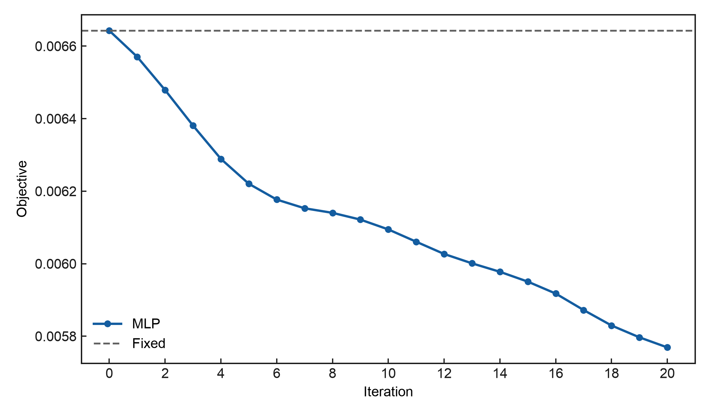
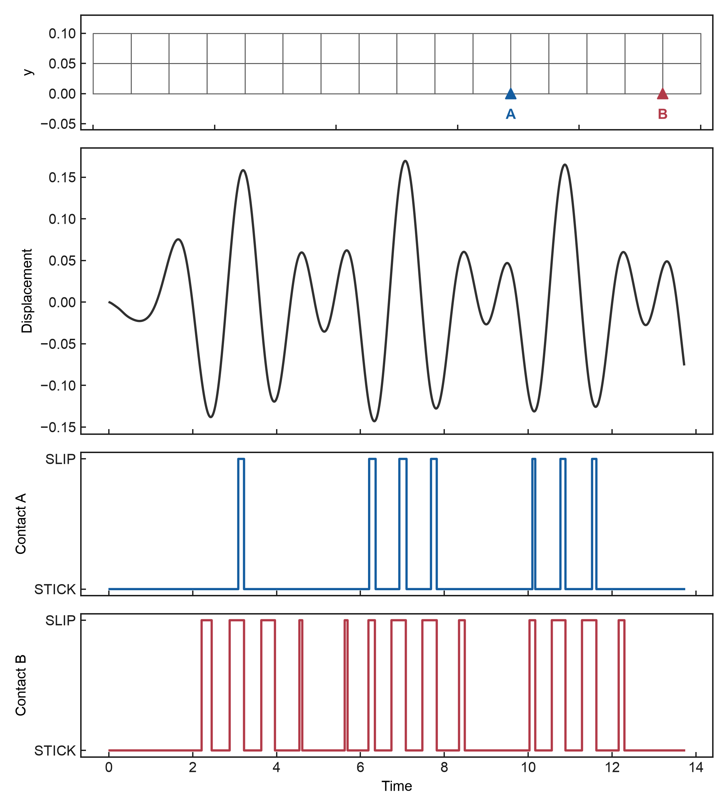
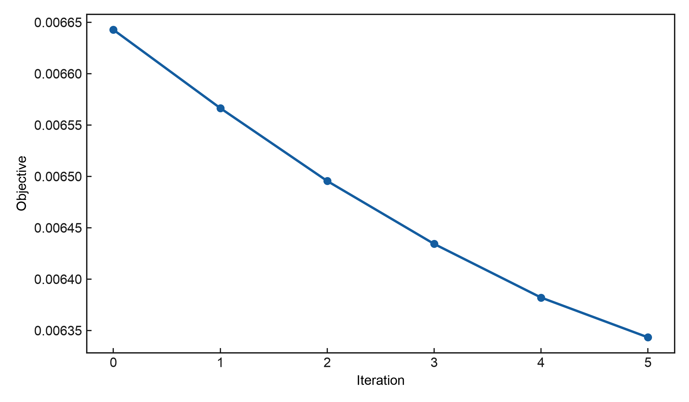

# Stochastic Stick-Slip Vibration Suppression with Tesseract

A small Mac-native mechanics demo in which a PyTorch controller learns a
seed-dependent friction preload through a low-dimensional Fourier interface.
The structural response uses JAX-FEM, the contact law keeps exact hard
STICK/SLIP switching, and Tesseract composes the different gradient systems.

The central design choice is deliberate: finite differences never touch the
MLP weights. They only see five Fourier coefficients for each stochastic seed.
PyTorch autograd handles the high-dimensional network parameters, while a
common-random-number (CRN) finite difference handles the non-smooth stochastic
mechanics boundary.

## Pipeline

```text
trainable theta [469]       forcing descriptors [8,6]
          │                           │
          └─────────────┬─────────────┘
                        ▼
┌────────────────────────────────────────────────────┐
│ fourier_controller Tesseract                       │
│ PyTorch MLP: 6 → 16 → 16 → 5                      │
│ gradient: PyTorch autograd VJP with respect to theta│
└───────────────────────┬────────────────────────────┘
                        │ Fourier coefficients [8,5]
                        ▼
┌────────────────────────────────────────────────────┐
│ stick_slip_fem Tesseract                           │
│ JAX/JAX-FEM + two hard Jenkins contacts            │
│ gradient: CRN-centered finite-difference VJP        │
└───────────────────────┬────────────────────────────┘
                        │ seed losses [8]
                        ▼
                 torch.mean(seed losses)
                        │
                        ▼
                   loss.backward()
                        │
                        ▼
                 gradient of theta [469]
```

The controller and mechanics are the two core Tesseracts. The older
`stochastic_objective` mean component remains available for H1–H4 compatibility,
but the main pipeline now computes the mean directly in host PyTorch.

For H2, the physics Tesseract receives fixed `q=(c,N_base)=(0.2,0.04)` and
the MLP produces

```text
z = [a0, a1, b1, a2, b2]
s(t) = a0 + a1 cos(w1 t) + b1 sin(w1 t)
     + a2 cos(w2 t) + b2 sin(w2 t)
N(t) = 0.04 + 0.02 tanh(s(t))
```

where `w1=0.9ω1` and `w2=1.35ω1` are the two existing forcing frequencies.
The coefficient Jacobian is evaluated in five batched columns: one positive
and one negative forward for each column, using the same seed on both sides
(10 batch forwards total for `[8,5]`). No FFT, dynamic top-K mode selection,
or finite difference over network weights is used.

## What is frozen

- 16×2 `QUAD4` cantilever, 32 elements, 102 total DOF and 96 free DOF;
- two independent hard Jenkins contacts on the lower surface;
- exact STICK/SLIP regime projection and slider updates;
- the existing 800-step integration, stochastic forcing and displacement-only loss;
- 32 fixed training seeds and one disjoint 64-seed held-out set.

## Results

### Stage H5 — two core Tesseracts

H5 moves the unchanged PyTorch controller behind a real Tesseract boundary.
The flat 469-parameter vector is differentiated by PyTorch autograd inside the
controller component; only five Fourier coefficients per seed cross into the
hard stochastic mechanics component, where the existing CRN finite difference
provides the VJP.

| quantity | result |
| --- | ---: |
| controller forward maximum absolute error | `0` |
| controller VJP maximum absolute error | `0` |
| controller VJP direction cosine | `1` |
| end-to-end theta gradient norm | `0.001616181727698509` |
| H5 32-seed training objective | `0.006108705858227541` |
| H5 64-seed test objective | `0.005971312227273379` |
| train/test delta from H4 | `0 / 0` |

The complete `theta → controller Tesseract → physics Tesseract → mean →
backward` chain reproduces H4 exactly while keeping finite differences away
from all 469 MLP parameters.

### Stage H4 — more stochastic training coverage

H4 changes only the stochastic training coverage: the original eight seeds are
augmented with seeds `201..224`, giving 32 training seeds. The physics,
controller architecture, initialization, optimizer and 20-step budget remain
unchanged. Evaluation uses 64 new seeds, `1001..1064`, exactly once after
training.

| controller | 32-seed training objective | improvement vs fixed | 64-seed test objective | improvement vs fixed |
| --- | ---: | ---: | ---: | ---: |
| Fixed | `0.006504099115381487` | — | `0.006348314853437941` | — |
| Shared Fourier | `0.006288536550850767` | `3.3143%` | `0.006147424838351543` | `3.1645%` |
| MLP Fourier | `0.006108705858227541` | `6.0791%` | `0.005971312227273379` | `5.9386%` |

This is **Case A / STRONG PASS**. The MLP test objective is `2.8648%` lower
than the retrained Shared controller. On the 64 held-out seeds, Shared beats
Fixed on 58, MLP beats Fixed on 62, and MLP beats Shared on 52. The MLP
train–test improvement gap is only `0.1405` percentage points, compared with
about `13.33` percentage points in H3. Increasing stochastic training coverage
therefore resolves the observed H3 generalization gap without changing the
network or mechanics.





### Stage H3 — ablation and 32-seed generalization

H3 compares the fixed preload against a single shared Fourier waveform and the
seed-conditioned MLP, with all physics and training settings frozen from H2.
Both trainable controllers use Adam at `lr=0.01` for exactly 20 steps.

| controller | 8-seed training objective | change vs fixed | 32-seed test objective | change vs fixed |
| --- | ---: | ---: | ---: | ---: |
| Fixed | `0.006642794744366401` | — | `0.006457748776761722` | — |
| Shared Fourier | `0.006336030858525896` | `-4.6180%` | `0.006305103508254330` | `-2.3638%` |
| MLP Fourier | `0.005769207113962147` | `-13.1509%` | `0.006469585300535207` | `+0.1833%` |

The shared controller improved 27 of 32 unseen seeds, while the MLP improved
16 of 32 and beat the shared controller on 14. The MLP therefore has clear
extra fitting capacity on the eight training seeds, but that advantage did not
generalize in this fixed experiment. No held-out result was used to retrain or
tune either controller.





#### Why a neural controller?

The forcing-conditioned MLP can produce a different waveform for each seed and
reduces the training objective by a further `8.9460%` relative to one shared
waveform. H3 also supplies the necessary negative evidence: with only eight
training seeds, that extra flexibility did not improve the aggregate 32-seed
test objective. The network is useful adaptive capacity, not an automatic
generalization guarantee.

#### Why low-dimensional Fourier control?

The MLP has 469 parameters, so a direct centered finite difference over its
weights would require 938 perturbed evaluations. The five-column Fourier
interface needs only 10 batch forwards, after which the Tesseract VJP carries
the result back through PyTorch. Across five fixed gradient repeats, the mean
cosine to the CRN mean direction was `0.976504`, compared with `0.209988` when
the positive and negative perturbations used independent seeds.

### Stage H2 — PyTorch Fourier controller

The native Mac CPU/Float64 run passed.

| quantity | result |
| --- | ---: |
| fixed objective `J_fixed` | `0.006642794744366401` |
| zero-initialized MLP `J_initial` | `0.006642794744366401` |
| first accepted Adam learning rate | `0.01` |
| objective after first real hard step | `0.006570569575355878` |
| objective after 20 steps `J_final` | `0.005769207113962147` |
| training reduction | `13.1509%` |
| held-out fixed objective | `0.006385067389503073` |
| held-out trained objective | `0.006199324621437767` |
| held-out reduction | `2.9090%` |
| trained `N(t)` range | `[0.0200217, 0.0597595]` |

The initial zero last layer reproduces the fixed `N=0.04` baseline exactly.
After training, the eight seeds receive genuinely different controls: the
maximum pairwise distance between coefficient rows is `2.62153`, and the
maximum pairwise RMS difference between their preload histories is `0.0215773`.
This is the intended role of the forcing descriptor: the network does not
collapse to one shared preload waveform.

The held-out result is reported once, after training, and is not used for any
model or learning-rate choice.





### Stage H1.5 — two-parameter baseline

The preceding public baseline also passes: all eight seeds show complete
STICK→SLIP→STICK cycles at both contact locations, and the first CRN-FD descent
step reduced `J` by `1.1484%`. Five accepted hard-forward steps gave a total
reduction of `4.5074%`.





## Reproduce locally

```bash
uv sync
uv run pytest -q
uv run python scripts/run_stage_h15.py
uv run python scripts/run_stage_h2.py
uv run python scripts/run_stage_h3.py
uv run python scripts/run_stage_h4.py
uv run python scripts/run_stage_h5.py
```

The test suite currently reports 22 passing tests. Two complete H3 runs with
the same Torch and forcing seeds produced identical objectives, controller
coefficients, per-seed comparisons and gradient diagnostics. The runs are
intentionally local: there is no Docker image, GPU, server, PETSc solve,
background job or push-time automation required.

## Repository layout

```text
stochastic_stick_slip/model.py                 JAX-FEM, forcing and hard contact
stochastic_stick_slip/controller.py            deterministic PyTorch MLP
tesseracts/fourier_controller/tesseract_api.py PyTorch controller apply/VJP
tesseracts/stick_slip_fem/tesseract_api.py    physics apply/JVP/VJP
tesseracts/stochastic_objective/tesseract_api.py
                                                legacy mean apply/JVP/VJP
scripts/run_stage_h15.py                       H1.5 baseline runner
scripts/run_stage_h2.py                        H2 training and diagnostics
scripts/run_stage_h3.py                        H3 ablation and generalization
scripts/run_stage_h4.py                        H4 stochastic training coverage
scripts/run_stage_h5.py                        H5 two-Tesseract regression
tests/                                          focused physics and composition tests
outputs/stage_h15/                              H1.5 figures
outputs/stage_h2/                               H2 figures
outputs/stage_h3/                               H3 figures
outputs/stage_h4/                               H4 figures
```

## License

This repository is licensed under Apache-2.0. JAX-FEM is used as an external
dependency and is distributed under GPL-3.0; no JAX-FEM source is copied into
this repository.
