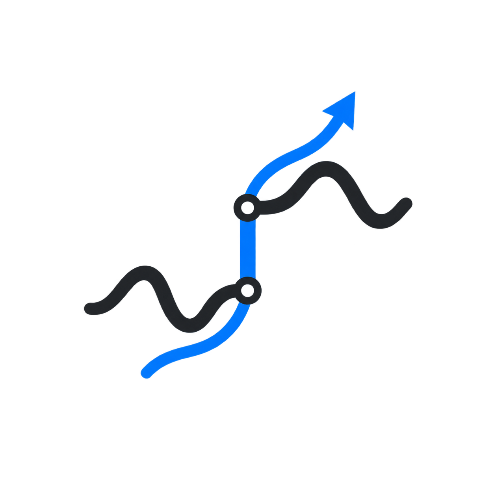
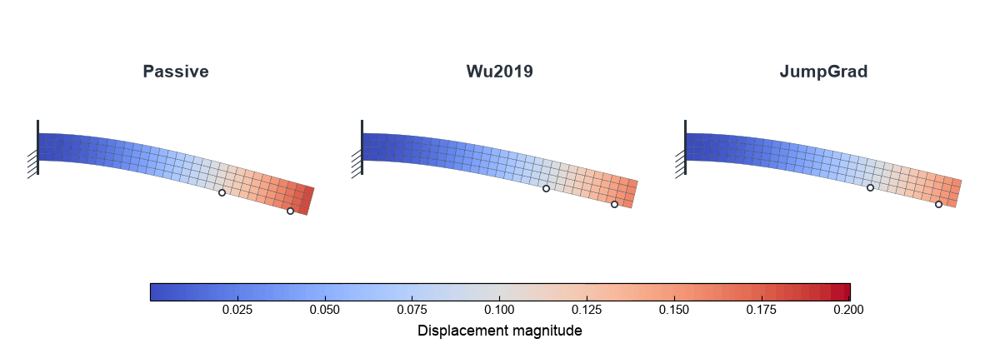
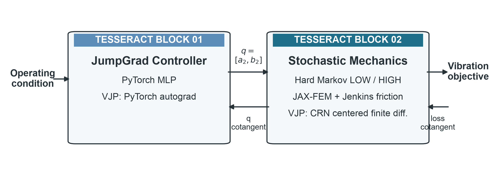
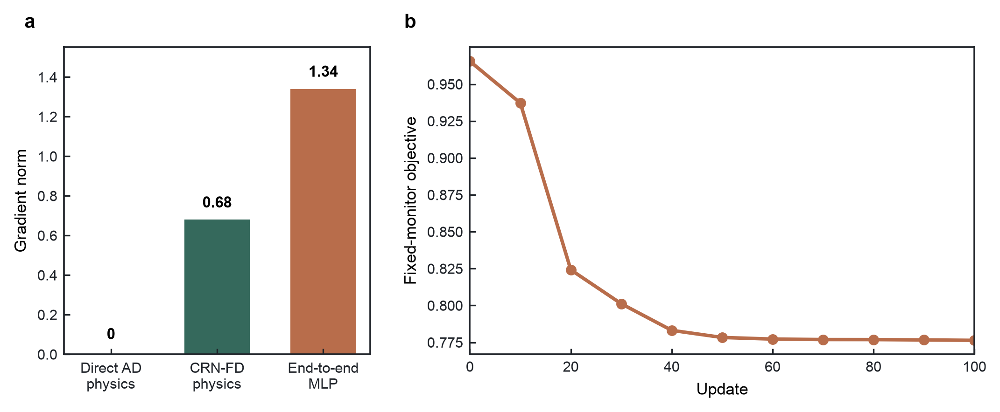
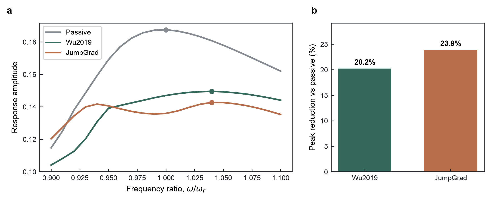
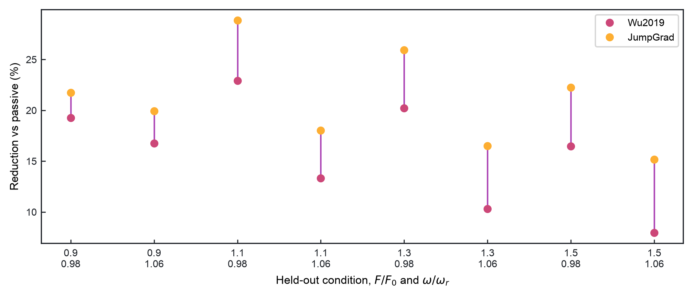

<p align="center">
  &nbsp;&nbsp;&nbsp;
  
</p>

<p align="center">
  <a href="https://pasteurlabs.ai/tesseract-hackathon-2026/">Tesseract Hackathon 2026</a> · <strong>Track 03 — Hybrid ML + Mechanistic Models</strong><br>
  <a href="#1-problem">Problem</a> · <a href="#2-method">Method</a> · <a href="#3-why-tesseract">Why Tesseract</a> · <a href="#4-results">Results</a> · <a href="#5-reproduce">Reproduce</a>
</p>

<p align="center">
  
</p>

The hero animation uses a four-contact visualization case for clarity; to keep the quantitative study computationally efficient, all results below use the original two-contact benchmark.

## 1. Problem

We study vibration suppression in a finite-element beam with two friction contacts. A neural controller observes the forcing amplitude and frequency, then changes the transition probabilities of a hard Markov actuator whose preload is always `LOW` or `HIGH`.

These switching decisions are discrete stochastic events. For a fixed random tape, a small controller-parameter change may leave the entire sampled switching trajectory unchanged, so ordinary automatic differentiation cannot provide a useful mechanics gradient through the hard path.

JumpGrad addresses this gap: it trains a neural controller end to end through the original stochastic mechanics system without smoothing away the switching events.

## 2. Method

JumpGrad combines a PyTorch neural controller, hard Markov switching, JAX-FEM mechanics, Jenkins friction, and custom gradient rules through Tesseract.

```text
Operating condition
        ↓
    PyTorch MLP
        ↓
switching parameters q
        ↓
hard LOW/HIGH Markov switching
        ↓
JAX-FEM + Jenkins friction
        ↓
vibration objective
        ↓
backward through Tesseract
```

The [`jumpgrad_controller`](tesseracts/jumpgrad_controller/tesseract_api.py) Tesseract maps operating conditions to `q=[a2,b2]`. The [`wu_v2_markov_fem`](tesseracts/wu_v2_markov_fem/tesseract_api.py) Tesseract converts `q` and explicit random tapes into hard preload histories, advances the beam response, and returns the vibration objective.

<p align="center">
  
</p>

Together, these two components form one end-to-end trainable system. The controller has 354 parameters, and the registered experiment optimizes them with 100 Adam updates while preserving the hard stochastic mechanics.

## 3. Why Tesseract

JumpGrad spans two computational worlds: a PyTorch neural controller and JAX-based stochastic mechanics. They also require different backward rules—the controller uses PyTorch autograd, while the mechanics uses common-random-number finite differences through hard switching. A single ordinary AD graph cannot supply the missing pathwise derivative across the sampled Markov events.

Tesseract is not another simulator in this workflow. It lets each component retain its own forward implementation and derivative rule, then composes those components into a modular end-to-end backward pass.

| Component | Forward | Backward |
|---|---|---|
| [`jumpgrad_controller`](tesseracts/jumpgrad_controller/tesseract_api.py) | operating condition → `q` | PyTorch autograd |
| [`wu_v2_markov_fem`](tesseracts/wu_v2_markov_fem/tesseract_api.py) | `q` + random tapes → vibration objective | CRN centered finite differences |

Tesseract composes these two derivative rules into the same end-to-end backward pass.

### Hard switching needs a custom gradient

For a fixed random tape, a small change in `q` can leave every sampled `LOW`/`HIGH` decision unchanged. The preload history and mechanical trajectory are then locally constant with respect to `q`; in the registered gradient audit, direct automatic differentiation through this real hard path returns a zero mechanics gradient.

Because the physics interface is only two-dimensional, a centered finite difference remains affordable while preserving the original hard forward model:

$$
g_i =
\frac{
L(q + \varepsilon e_i;\xi) - L(q - \varepsilon e_i;\xi)
}{
2\varepsilon
}.
$$

Each `+eps`/`-eps` pair receives the same explicit `markov_tapes`. This common-random-number coupling suppresses unrelated stochastic variation, while the forward pass retains the real `LOW`/`HIGH` switching events. The resulting mechanics cotangent is then propagated through the controller with PyTorch autograd.

### Bonus — we forked and modified Tesseract Core

The mechanics block uses our [independent-batch extension to Tesseract Core](https://github.com/dazhizhao/tesseract-core/commit/43fe09bd8ef1a96569e8499d022482d1ae4ce1de). For batched `q[B,2]`, it perturbs one coefficient across all independent conditions at once, reducing centered differences from `4B` mechanics evaluations to four while preserving same-tape CRN pairing.

<p align="center">
  
</p>

## 4. Results

JumpGrad produces a trainable end-to-end gradient through the discrete stochastic simulator and improves vibration suppression on both the benchmark and fresh random realizations.

On the same numerical JAX-FEM/Jenkins benchmark, the reproduced Wu2019 control method reduces the sampled resonance peak by about 20.2% relative to passive friction. JumpGrad reaches **23.9%** reduction. Both peaks lie inside the sampled local-FRF window.

<p align="center">
  
</p>

The frozen controller was evaluated on 128 unseen random realizations, each aggregated with equal weight across the same eight held-out operating conditions. Training improves the mean aggregate reduction from **2.99% → 21.11%**, and **128/128** realizations improve. Because the MLP receives forcing amplitude and frequency, it learns condition-dependent switching parameters rather than one fixed setting.

<p align="center">
  
</p>

## 5. Reproduce

Python 3.12 and [uv](https://docs.astral.sh/uv/) are required.

```bash
uv sync
uv run python scripts/run_jumpgrad_end_to_end.py
uv run python scripts/run_jumpgrad_generalization.py
uv run --with matplotlib==3.11.1 --with pillow==12.3.0 \
  python scripts/render_jumpgrad_visuals.py
```

Add `--train` to `run_jumpgrad_end_to_end.py` to run the complete registered 100-update experiment instead of the quick two-Tesseract demo.

## 6. References

1. Y. G. Wu et al., “Design of semi-active dry friction dampers for steady-state vibration: sensitivity analysis and experimental studies,” *Journal of Sound and Vibration* 459, 114850 (2019). [doi:10.1016/j.jsv.2019.114850](https://doi.org/10.1016/j.jsv.2019.114850)
2. D. Häfner and A. Lavin, “Tesseract Core: Universal, autodiff-native software components for Simulation Intelligence,” *Journal of Open Source Software* 10(111), 8385 (2025). [doi:10.21105/joss.08385](https://doi.org/10.21105/joss.08385)
3. T. Xue et al., “JAX-FEM: A differentiable GPU-accelerated 3D finite element solver for automatic inverse design and mechanistic data science,” *Computer Physics Communications* 291, 108802 (2023). [doi:10.1016/j.cpc.2023.108802](https://doi.org/10.1016/j.cpc.2023.108802)
4. H. J. Suh, M. Simchowitz, K. Zhang, and R. Tedrake, “Do Differentiable Simulators Give Better Policy Gradients?” *Proceedings of Machine Learning Research* 162, 20668–20696 (2022). [PMLR](https://proceedings.mlr.press/v162/suh22b.html)
5. L. Dai, “Rate of Convergence for Derivative Estimation of Discrete-Time Markov Chains via Finite-Difference Approximation with Common Random Numbers,” *SIAM Journal on Applied Mathematics* 57(3), 731–751 (1997). [doi:10.1137/S003613999427173X](https://doi.org/10.1137/S003613999427173X)

The repository is licensed under [Apache-2.0](LICENSE). JAX-FEM is an external GPL-3.0 dependency; its source is not copied into this repository.
