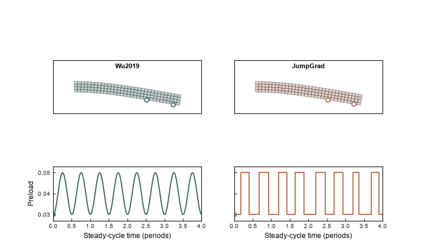

# JumpGrad: End-to-End Optimization through Discrete Stochastic Mechanics

<p align="center">
  
</p>

<p align="center"><em>
<strong>Figure 1.</strong> Passive vibration, Wu2019 control, and JumpGrad under the same FEM model, forcing condition, time window, and deformation scale.
</em></p>

JumpGrad trains a neural controller through hard random switching events in a friction-controlled mechanical system. Direct automatic differentiation cannot see through these discrete events, so JumpGrad combines PyTorch autograd with common-random-number finite differences through [Tesseract](https://github.com/pasteurlabs/tesseract-core).

## 1. Overview

We study vibration suppression in a finite-element beam with two friction contacts. The controller can influence the mechanics only by changing the probabilities of hard `LOW`/`HIGH` friction-preload switches.

This makes the optimization unusual: small parameter changes often leave a sampled switching trajectory unchanged, so direct automatic differentiation returns no useful physics gradient. JumpGrad makes this system trainable end to end while preserving the discrete switching events and the Jenkins friction law.

## 2. From Wu2019 to JumpGrad

We first reproduced the Wu2019 2ω friction-control method on the same JAX-FEM benchmark. Wu2019 provides a strong reference: its smooth periodic preload modulation reduces the sampled resonance peak by about 20.2% relative to passive friction.

JumpGrad replaces that smooth actuation with genuinely discrete `LOW`/`HIGH` switching. The learned controller reaches about 23.9% peak reduction, and its sampled resonance peak is approximately 4.6% lower than the Wu2019 baseline on the same benchmark. The reported Wu2019 and JumpGrad peaks both lie inside the sampled local-FRF window.

<p align="center">
  
</p>

<p align="center"><em>
<strong>Figure 2.</strong> Resonance response on the same JAX-FEM benchmark. Wu2019 already provides strong vibration suppression, while JumpGrad further lowers the sampled resonance peak.
</em></p>

## 3. Why ordinary backpropagation fails

The neural network does not directly set the friction force. It changes the probabilities of `LOW`/`HIGH` switching events.

For a fixed random sequence, a small parameter perturbation may produce exactly the same discrete trajectory. Direct automatic differentiation therefore sees a locally unchanged mechanical path and returns zero physics gradient.

Common-random-number finite differences compare nearby policies using the same random tapes. This isolates the policy perturbation from unrelated Monte Carlo noise and reveals how changed switching decisions affect the mechanical response.

<p align="center">
  
</p>

<p align="center"><em>
<strong>Figure 3.</strong> Direct AD returns zero through the hard switching process, while CRN finite differences provide a usable physics gradient. That gradient is propagated through the PyTorch controller and drives end-to-end training.
</em></p>

## 4. End-to-end JumpGrad

```text
Operating condition
        ↓
   PyTorch MLP
        ↓  autograd
     [a2, b2]
        ↓
Hard Markov switching
        ↓  CRN finite difference
JAX-FEM + Jenkins friction
        ↓
 vibration objective
```

The MLP receives the excitation amplitude and frequency and outputs two switching parameters. The hard Markov process converts them into discrete preload histories, and JAX-FEM advances the structural response with Jenkins friction. Tesseract composes the PyTorch controller and stochastic JAX-FEM mechanics into one end-to-end optimization chain, while each component keeps its own gradient rule. A conventional `loss.backward()` then propagates the physics-side CRN finite-difference direction through the controller with autograd.

<p align="center">
  
</p>

<p align="center"><em>
<strong>Figure 4.</strong> Wu2019 uses smooth periodic preload modulation, while JumpGrad acts through discrete LOW/HIGH switching events. JumpGrad learns when these hard switches should occur from the vibration objective.
</em></p>

## 5. Results

Wu2019 reduces the sampled resonance peak by about 20.2% relative to passive friction on this benchmark. JumpGrad reaches about 23.9% reduction, with a peak roughly 4.6% below Wu2019.

During end-to-end training, the fixed monitoring objective also decreases substantially. Together with the nonzero controller gradient, this shows that the neural network is genuinely optimized through the stochastic mechanical system rather than acting as a decorative front end.

Detailed numerical artifacts are available in the [end-to-end training summary](outputs/jumpgrad_end_to_end/summary.md) and the [Wu2019 reproduction scorecard](outputs/wu2019_reproduction/scorecard.md).

## 6. What the controller learned

JumpGrad does not simply learn one fixed setting. The PyTorch controller receives the excitation amplitude and frequency and produces different switching parameters for different operating conditions.

As training progresses, the stochastic policy develops a strong phase preference and behaves increasingly like a structured periodic switching rule. A separately optimized deterministic binary controller remains extremely competitive, so the result should not be interpreted as evidence that randomness is always superior.

## 7. Reproduce

Python 3.12 and [uv](https://docs.astral.sh/uv/) are required.

```bash
uv sync
uv run pytest -q
```

Run the end-to-end JumpGrad experiment:

```bash
uv run python scripts/run_jumpgrad_end_to_end.py
```

Regenerate the four final visual assets from the frozen results:

```bash
uv run python scripts/render_jumpgrad_visuals.py
```

## 8. Scope

Wu2019 here means its 2ω friction-control method reproduced on the same numerical JAX-FEM/Jenkins benchmark. This repository does not claim a direct comparison with the experimental structure or solver used by Wu et al.

JumpGrad's contribution is end-to-end, condition-aware optimization through a simulator containing hard random switching. A strong fixed controller performs similarly over the tested operating range, so the result is not a claim that stochastic control universally outperforms deterministic control.

## 9. References

1. Y. G. Wu et al., “Design of semi-active dry friction dampers for steady-state vibration: sensitivity analysis and experimental studies,” *Journal of Sound and Vibration* 459, 114850 (2019). [doi:10.1016/j.jsv.2019.114850](https://doi.org/10.1016/j.jsv.2019.114850)
2. [Tesseract](https://github.com/pasteurlabs/tesseract-core) — composable differentiable software components with custom derivative rules.
3. [JAX-FEM](https://github.com/deepmodeling/jax-fem) — differentiable finite-element analysis in JAX.

The repository is licensed under [Apache-2.0](LICENSE). JAX-FEM is an external GPL-3.0 dependency; its source is not copied into this repository.
