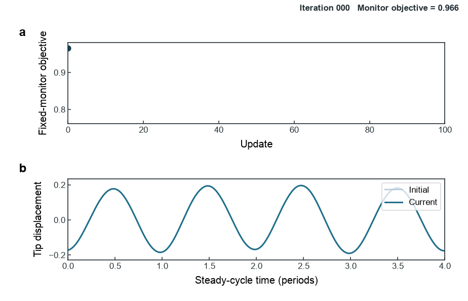

# JumpGrad: End-to-End Gradient Optimization through Discrete Stochastic Mechanics

<p align="center">
  
</p>

JumpGrad is a [Tesseract Hackathon 2026](https://pasteurlabs.ai/tesseract-hackathon-2026/) **Track 03 — Hybrid ML + mechanistic models** entry. It performs end-to-end gradient optimization of a PyTorch controller through a JAX-based frictional mechanics solver whose hard random switching events make the sampled physics gradient invisible to ordinary automatic differentiation.

## 1. Overview

We study vibration suppression in a finite-element beam with two friction contacts. The controller cannot set a continuous friction force. It can only change the transition rates of a hard Markov actuator whose preload is always `LOW` or `HIGH`.

The forward mechanics retains the discrete switching events and Jenkins friction law. The backward pass combines a PyTorch autograd VJP for the neural controller with a common-random-number centered finite-difference VJP for the stochastic mechanics.

## 2. Why this is a Tesseract problem

The workflow contains two peer software components, and each component is a Tesseract:

- [`jumpgrad_controller`](tesseracts/jumpgrad_controller/tesseract_api.py) contains the condition-aware PyTorch MLP and uses `torch.autograd` for its VJP.
- [`wu_v2_markov_fem`](tesseracts/wu_v2_markov_fem/tesseract_api.py) contains the hard Markov actuator, JAX-FEM beam dynamics, and Jenkins friction; its VJP uses common-random-number centered finite differences.

| Boundary | Controller Tesseract | Mechanics Tesseract |
|---|---|---|
| Framework | PyTorch | JAX-based mechanics |
| Derivative strategy | PyTorch autograd | CRN centered finite difference |
| Physics | Smooth neural network | Hard stochastic switching and friction |

<p align="center">
  
</p>

The differentiable connection between the two blocks carries only the switching coefficients `q=[a2,b2]`; operating conditions and random tapes remain explicit ordinary inputs to the mechanics block. The backward interface returns the cotangent of `q`, allowing both derivative rules to participate in one end-to-end `loss.backward()` call. Tesseract is therefore the composition infrastructure, not a decorative wrapper inserted between the controller and mechanics.

**Engineering contribution.** The mechanics block now uses an [independent-batch extension to Tesseract Core's generic finite-difference VJP](https://github.com/dazhizhao/tesseract-core/commit/43fe09bd8ef1a96569e8499d022482d1ae4ce1de). For batched `q[B,2]`, it perturbs one coefficient across all independent conditions at once, reducing centered differences from `4B` mechanics evaluations to four while leaving the explicit `markov_tapes` unchanged in every `+eps`/`-eps` pair.

## 3. From Wu2019 to hard switching

We first reproduced the Wu2019 2ω friction-control method on the same JAX-FEM benchmark. Its smooth periodic preload modulation is a strong engineering baseline, reducing the sampled resonance peak by about 20.2% relative to passive friction.

JumpGrad replaces smooth modulation with a genuinely discrete actuator. At every time step, each contact is commanded to one of two frozen preload levels; the learned coefficients change only the Markov transition rates.

Wu2019 here means its control method reproduced on this numerical JAX-FEM/Jenkins benchmark, not the original experimental structure or solver.

## 4. Why ordinary AD fails

For a fixed random tape, a small change in `q` can leave every sampled `LOW`/`HIGH` decision unchanged. The resulting preload history and mechanical trajectory are then locally constant with respect to `q`. In the registered gradient audit, direct automatic differentiation through this real hard path returns a zero physics gradient.

This is not a claim that automatic differentiation fails for every stochastic system. It is a measured property of this sampled hard-switching pipeline: the parameter sensitivity is carried by changes in discrete event history, not by a smooth pathwise dependence.

## 5. Why finite differences and common random numbers

Finite differences are a standard simulation-gradient option when analytic or pathwise derivatives are unavailable. Here the physics interface is only two-dimensional, so a centered difference remains affordable while preserving the original hard forward model:

```text
g_i = [L(q + eps e_i; tape) - L(q - eps e_i; tape)] / (2 eps)
```

The `+eps` and `-eps` evaluations receive exactly the same explicit `markov_tapes`. This common-random-number coupling reduces contamination from unrelated Monte Carlo variation and isolates the effect of the policy perturbation. Randomness is therefore ordinary, reproducible input data at the Tesseract boundary; the project does not claim that Tesseract previously lacked CRN support.

JAX-FEM remains valuable because it supplies the genuine finite-element structural solver and differentiable smooth mechanics. Its automatic differentiation cannot, by itself, recover sensitivity lost at the surrounding hard event map. The physics-side finite-difference VJP bridges that event boundary without softening the Markov decisions.

<p align="center">
  
</p>

## 6. End-to-end optimization

The controller receives normalized excitation amplitude and frequency and outputs `q=[a2,b2]`. The mechanics Tesseract converts `q` and an explicit random tape into hard preload histories, advances the JAX-FEM/Jenkins response, and returns the vibration objective.

During the backward pass, the mechanics Tesseract estimates the cotangent of `q` using two coefficients × centered finite differences. The controller Tesseract then propagates that cotangent to all 354 network parameters with PyTorch autograd. The nonzero end-to-end gradient drives a 100-update Adam training run whose fixed monitoring objective decreases by about 19.6%.

<p align="center">
  
</p>

## 7. Results

<p align="center">
  
</p>

<p align="center">
  
</p>

Wu2019 reduces the sampled resonance peak by about 20.2% relative to passive friction. JumpGrad reaches about 23.9% reduction, and its sampled peak is approximately 4.6% lower than the reproduced Wu2019 baseline. Both peaks lie inside the sampled local-FRF window.

The learned MLP also outputs different switching parameters for different operating conditions. A separately optimized deterministic binary controller remains highly competitive, so these results demonstrate trainability through hard stochastic mechanics rather than universal superiority of stochastic control.

## 8. Reproduce and scope

Python 3.12 and [uv](https://docs.astral.sh/uv/) are required. The default command runs a compact end-to-end demo through both Tesseract blocks: it checks the three gradient routes and completes one Adam update without changing the frozen showcase results.

```bash
git clone https://github.com/dazhizhao/stochastic-stick-slip-tesseract.git
cd stochastic-stick-slip-tesseract
uv sync
uv run python scripts/run_jumpgrad_end_to_end.py
```

The complete registered 100-update experiment is available through the same entry point:

```bash
uv run python scripts/run_jumpgrad_end_to_end.py --train
```

The reported comparison is between control methods evaluated on the same numerical benchmark. It is not a direct comparison with the experimental system used by Wu et al. The project also does not claim that stochastic switching generally outperforms deterministic control.

## 9. References

1. Y. G. Wu et al., “Design of semi-active dry friction dampers for steady-state vibration: sensitivity analysis and experimental studies,” *Journal of Sound and Vibration* 459, 114850 (2019). [doi:10.1016/j.jsv.2019.114850](https://doi.org/10.1016/j.jsv.2019.114850)
2. D. Häfner and A. Lavin, “Tesseract Core: Universal, autodiff-native software components for Simulation Intelligence,” *Journal of Open Source Software* 10(111), 8385 (2025). [doi:10.21105/joss.08385](https://doi.org/10.21105/joss.08385)
3. T. Xue et al., “JAX-FEM: A differentiable GPU-accelerated 3D finite element solver for automatic inverse design and mechanistic data science,” *Computer Physics Communications* 291, 108802 (2023). [doi:10.1016/j.cpc.2023.108802](https://doi.org/10.1016/j.cpc.2023.108802)
4. M. C. Fu, “Gradient Estimation,” *Handbooks in Operations Research and Management Science* 13, 575–616 (2006). [doi:10.1016/S0927-0507(06)13019-4](https://doi.org/10.1016/S0927-0507(06)13019-4)
5. N. L. Kleinman, J. C. Spall, and D. Q. Naiman, “Simulation-Based Optimization with Stochastic Approximation Using Common Random Numbers,” *Management Science* 45(11), 1570–1578 (1999). [doi:10.1287/mnsc.45.11.1570](https://doi.org/10.1287/mnsc.45.11.1570)
6. P. Glasserman and D. D. Yao, “Some Guidelines and Guarantees for Common Random Numbers,” *Management Science* 38(6), 884–908 (1992). [doi:10.1287/mnsc.38.6.884](https://doi.org/10.1287/mnsc.38.6.884)

The repository is licensed under [Apache-2.0](LICENSE). JAX-FEM is an external GPL-3.0 dependency; its source is not copied into this repository.
