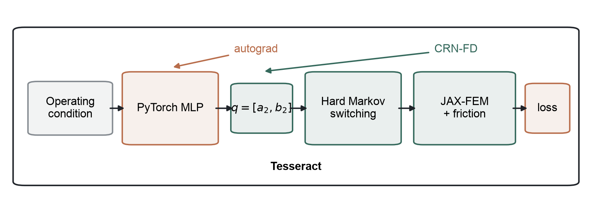
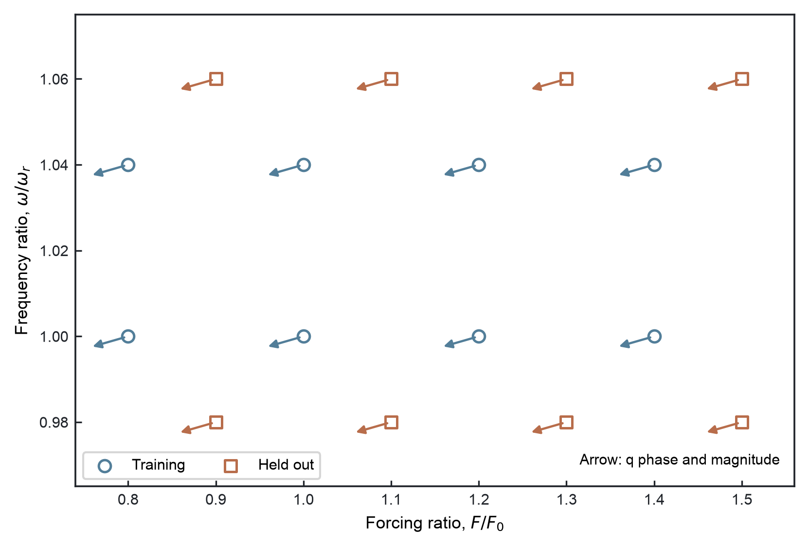

# JumpGrad visual preview

Beam vibration under passive friction, Wu2019 control, and JumpGrad at the same held-out operating condition. Wu2019 here refers to the reproduced control method on the same FEM benchmark.

Held-out condition: `F/F0=1.3`, `omega/omega_r=1.06`.

JumpGrad composes PyTorch autograd with a CRN-FD physics VJP across the hard Markov and JAX-FEM boundary.

JumpGrad lowers the sampled resonance peak beyond the reproduced Wu2019 controller on the same FEM benchmark.

Direct AD returns zero through hard switching, while CRN-FD recovers a usable direction and the fixed monitor falls during end-to-end training.

Wu2019 uses smooth periodic preload modulation; JumpGrad acts through a genuinely discrete LOW/HIGH switching path.

The final MLP maps each operating condition to its own switching-law coefficients; arrow direction and length encode q phase and magnitude.
